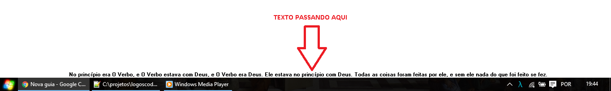

# Barra de Mensagens

Pelo fato de ficar muito tempo no computador e ficar lutando contra o tempo para meditar a respeito de alguns temas, tive a ideia de criar uma barrinha na tela do computador onde eu possa cadastrar mensagens e deixar as mesmas percorrendo na minha tela. 

Mais detalhes sobre a mesma você poderá encontrar aqui: [https://logoscoder.github.io/Barra-de-Mensagens.html](https://logoscoder.github.io/Barra-de-Mensagens.html)

### Autor

* **Jessé Silva** - aka - *logoscoder* - [logoscoder.github.io](https://logoscoder.github.io)